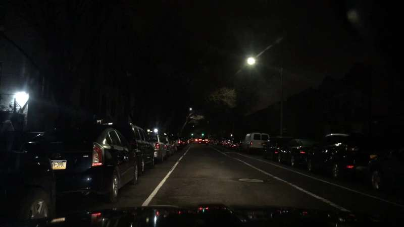
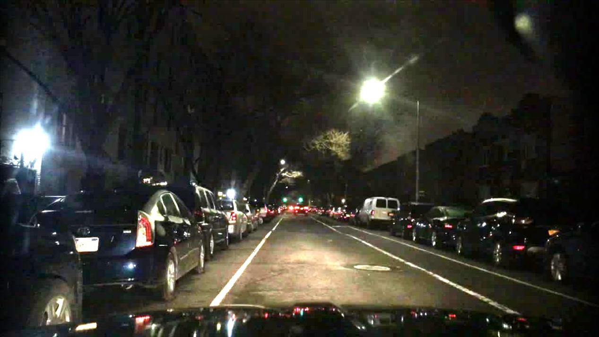
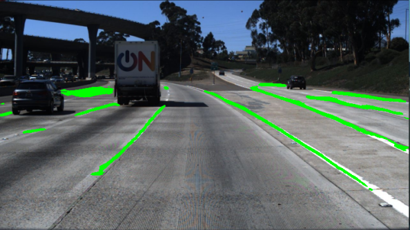
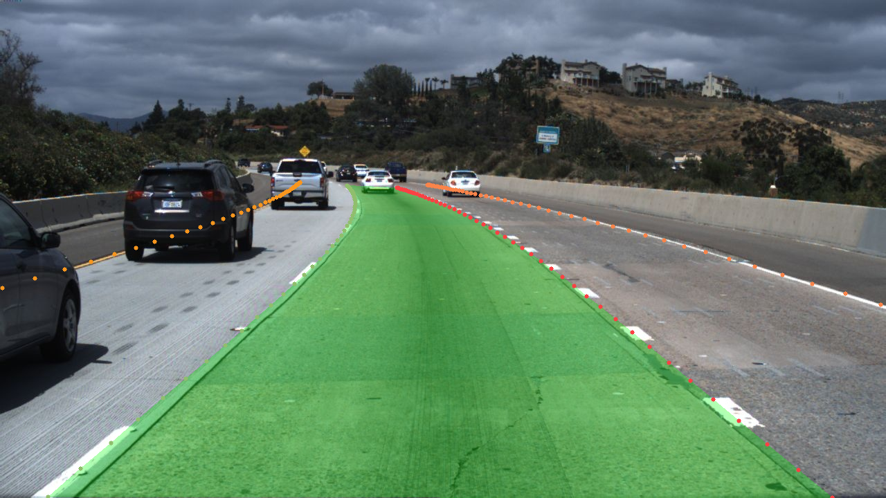
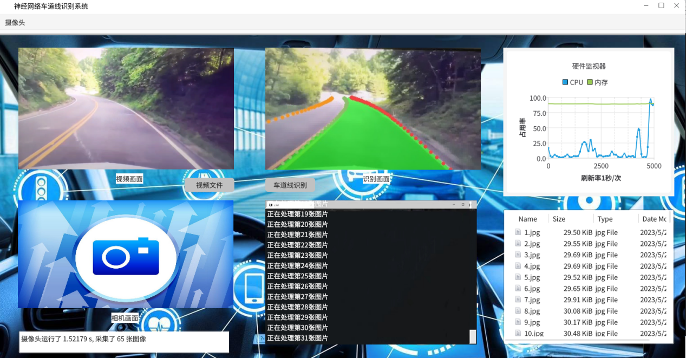

## Lane_Detection_on_KylinPhytium-2000/4

This project is based on the KylinPhytium-2000/4 platform and used to detect lanes in videos or cameras. The project includes the following parts: 
    --image preprocessing based on algorithm from [LIME: Low-Light Image Enhancement via Illumination Map Estimatio] (https://ieeexplore.ieee.org/document/7782813);
    --lane detection based on network models UNet and Transformer;
    --GUI developed with QT.

Several achievements we have made:
    --Reconstruct the LIME preprocessing algorithm with C++;  
    --Use NEON instructions and OpenMP API to speed up the LIME algorithm;  
    --Rewrite the Fouriour transform algorithm instead of cv::dft and cv::idft to improve the performance of the LIME algorithm;  
    --Use Depthwise Separable Convolution and Quantization on UNet to reduce the model size and speed up the inference;  
    --Deploy UNet on the NCNN framework and transformer on the onnx framework to speed up the inference;  
    --Develop a realtime monitor module in GUI to display the hardware performance including CPU and memory usage.  
## Requirements

* KylinPhytium-2000/4
* OpenCV 4.7.0
* NCNN
* onnxruntime
* Qt 5.12.8

## Usage

1.LIME preprocessing
* `mkdir build`
* `cd build`
* `cmake ..`
* `make`
* `./lime`

2.Network inference
* `mkdir build`
* `cd build`
* `cmake ..`
* `make`
* `./unet_ncnn ../images/0.jpg` for UNet
* `./LSTR` for Transformer

3.GUI
Need QT creator based on Qt 5.12.8

## Performance

For the LIME preprocessing, the performance is shown as follows:

Before LIME preprocessing:

  

After LIME preprocessing:

  

For the network inference, the performance is shown as follows:

UNet:

  
</

Transformer:

  

The GUI is shown as follows:

  

## Demo

The demo is shown in the video:

https://github.com/wizard0515/Human_pose_estimation_on_jetson_nano/issues/1#issue-2069124498